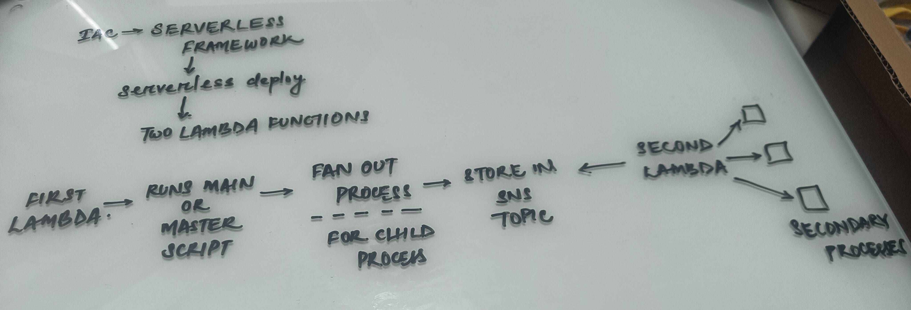

This repository shares a code example to run a fan-out design pattern using a scraping example leveraging playwright.

Architecture for same:

Pre-requisite to run it:
1. [serverless framework installed](https://www.serverless.com/framework/docs/getting-started)
2. node, npm installed
3. aws configure command setup

To deploy run:
`serverless deploy`

To test run:

`serverless invoke -f parentFunction`

To check output run:
1. `serverless logs -f parentFunction`
2. `serverless logs -f childFunction`

To destroy all resources so as not to incur cost run:
1. `serverless remove`

